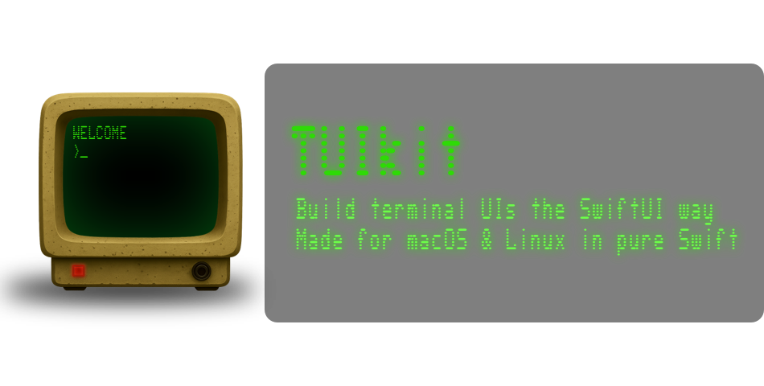

[](https://github.com/phranck/TUIkit/actions/workflows/ci.yml)




# TUIkit

> [!TIP]
> **☕ Support TUIkit Development**
>
> If you enjoy TUIkit and find it useful, consider supporting its development! Your donations help cover ongoing costs like hosting, tooling, and the countless cups of coffee that fuel late-night coding sessions. Every contribution: big or small: is greatly appreciated and keeps this project alive. Thank you! 💙
>
> [](https://paypal.me/LAYEREDwork)
> [](https://ko-fi.com/layeredwork)

> [!IMPORTANT]
> **This project is currently a WORK IN PROGRESS! I strongly advise against using it in a production environment because APIs are subject to change at any time.**

A SwiftUI-like framework for building Terminal User Interfaces in Swift: no ncurses, no C dependencies, just pure Swift.

## What is this?

TUIkit lets you build TUI apps using the same declarative syntax you already know from SwiftUI. Define your UI with `View`, compose views with `VStack`, `HStack`, and `ZStack`, style text with modifiers like `.bold()` and `.foregroundColor(.red)`, and run it all in your terminal.

```swift
import TUIkit

@main
struct MyApp: App {
    var body: some Scene {
        WindowGroup {
            ContentView()
        }
    }
}

struct ContentView: View {
    @State var count = 0
    
    var body: some View {
        VStack(spacing: 1) {
            Text("Hello, TUIkit!")
                .bold()
                .foregroundColor(.cyan)
            
            Text("Count: \(count)")
            
            Button("Increment") {
                count += 1
            }
        }
        .statusBarItems {
            StatusBarItem(shortcut: "q", label: "quit")
        }
    }
}
```

## Features

### Core

- **`View` protocol**: the core building block, mirroring SwiftUI's `View`
- **`@ViewBuilder`**: result builder for declarative view composition
- **`@State`**: reactive state management with automatic re-rendering
- **`@Environment`**: dependency injection for theme, focus manager, status bar
- **`App` protocol**: app lifecycle with signal handling and run loop

### Views & Components

- **Primitive views**: `Text`, `EmptyView`, `Spacer`, `Divider`
- **Layout containers**: `VStack`, `HStack`, `ZStack` with alignment and spacing
- **Interactive**: `Button` with focus states, `Menu` with keyboard navigation
- **Containers**: `Alert`, `Dialog`, `Panel`, `Box`, `Card`
- **`StatusBar`**: context-sensitive keyboard shortcuts
- **`ForEach`**: iterate over collections, ranges, or `Identifiable` data

### Styling

- **Text styling**: bold, italic, underline, strikethrough, dim, blink, inverted
- **Full color support**: ANSI colors, 256-color palette, 24-bit RGB, hex values, HSL
- **Theming**: 6 predefined palettes (Green, Amber, Red, Violet, Blue, White)
- **Border styles**: rounded, line, double, thick, ASCII, and more

### Advanced

- **Lifecycle modifiers**: `.onAppear()`, `.onDisappear()`, `.task()`
- **Storage**: `@AppStorage`, `@SceneStorage` with JSON backend
- **Preferences**: bottom-up data flow with `PreferenceKey`
- **Focus system**: Tab/Shift+Tab navigation between interactive elements

## Run the Example App

```bash
swift run TUIkitExample
```

Press `q` or `ESC` to exit.

## Installation

Add TUIkit to your `Package.swift`:

```swift
dependencies: [
    .package(url: "https://github.com/phranck/TUIkit.git", branch: "main")
]
```

Then add it to your target:

```swift
.target(
    name: "YourApp",
    dependencies: ["TUIkit"]
)
```

## Theming

TUIkit includes predefined palettes inspired by classic terminals:

```swift
@main
struct MyApp: App {
    var body: some Scene {
        WindowGroup {
            ContentView()
        }
        .palette(SystemPalette(.green))  // Classic green terminal
    }
}
```

Available palettes (all via `SystemPalette`):
- `.green`: Classic P1 phosphor CRT (default)
- `.amber`: P3 phosphor monochrome
- `.red`: IBM 3279 plasma
- `.violet`: Retro sci-fi terminal
- `.blue`: VFD/LCD displays
- `.white`: DEC VT100/VT220 (P4 phosphor)

## Architecture

- **No singletons for state**: All state flows through the Environment system
- **Pure ANSI rendering**: No ncurses or other C dependencies
- **Linux compatible**: Works on macOS and Linux (XDG paths supported)
- **Value types**: Views are structs, just like SwiftUI

## Project Structure

```
Sources/
├── TUIkit/
│   ├── App/              App, Scene, WindowGroup
│   ├── Core/             View, ViewBuilder, State, Environment, Color, Theme
│   ├── Modifiers/        Border, Frame, Padding, Overlay, Lifecycle
│   ├── Rendering/        Terminal, ANSIRenderer, ViewRenderer, FrameBuffer
│   └── Views/            Text, Stacks, Button, Menu, Alert, StatusBar, ...
└── TUIkitExample/        Example app (executable target)

Tests/
└── TUIkitTests/          668 tests across 104 test suites
```

## Requirements

- Swift 6.0+
- macOS 10.15+ or Linux

## Developer Notes

- Tests use Swift Testing (`@Test`, `#expect`): run with `swift test`
- All 668 tests run in parallel
- The `Terminal` class handles raw mode and cursor control via POSIX `termios`

## Contribution

## License

This repository has been published under the [MIT](https://mit-license.org) license.
