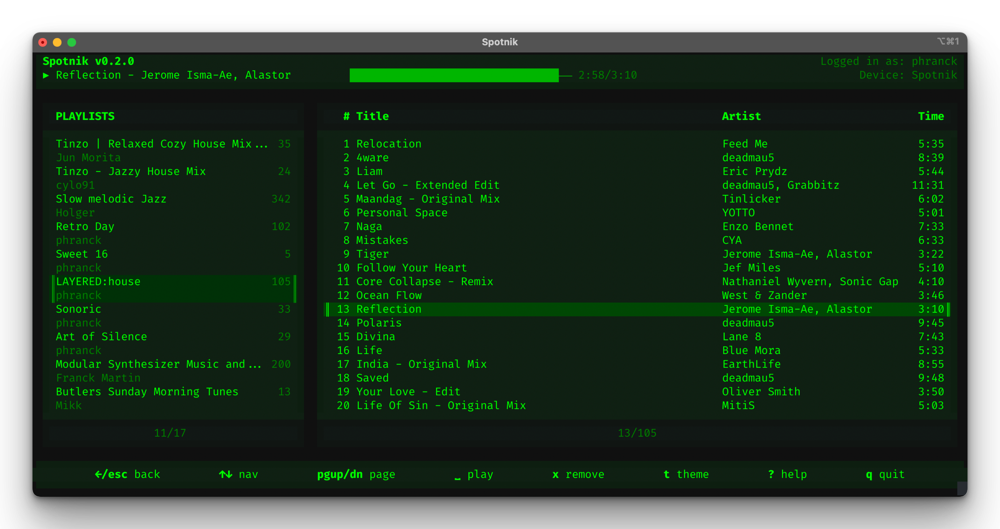

[](https://github.com/phranck/TUIKit/actions/workflows/ci.yml)




# TUIKit

A SwiftUI-like framework for building Terminal User Interfaces in Swift — no ncurses, no C dependencies, just pure Swift.

## What is this?

TUIKit lets you build TUI apps using the same declarative syntax you already know from SwiftUI. Define your UI with `View`, compose views with `VStack`, `HStack`, and `ZStack`, style text with modifiers like `.bold()` and `.foregroundColor(.red)`, and run it all in your terminal.

```swift
import TUIKit

@main
struct MyApp: App {
    var body: some Scene {
        WindowGroup {
            ContentView()
        }
    }
}

struct ContentView: View {
    @State var count = 0
    
    var body: some View {
        VStack(spacing: 1) {
            Text("Hello, TUIKit!")
                .bold()
                .foregroundColor(.cyan)
            
            Text("Count: \(count)")
            
            Button("Increment") {
                count += 1
            }
        }
        .statusBarItems {
            StatusBarItem(shortcut: "q", label: "quit")
        }
    }
}
```

## Features

### Core

- **`View` protocol** — the core building block, mirroring SwiftUI's `View`
- **`@ViewBuilder`** — result builder for declarative view composition
- **`@State`** — reactive state management with automatic re-rendering
- **`@Environment`** — dependency injection for theme, focus manager, status bar
- **`App` protocol** — app lifecycle with signal handling and run loop

### Views & Components

- **Primitive views** — `Text`, `EmptyView`, `Spacer`, `Divider`
- **Layout containers** — `VStack`, `HStack`, `ZStack` with alignment and spacing
- **Interactive** — `Button` with focus states, `Menu` with keyboard navigation
- **Containers** — `Alert`, `Dialog`, `Panel`, `Box`, `Card`
- **`StatusBar`** — context-sensitive keyboard shortcuts
- **`ForEach`** — iterate over collections, ranges, or `Identifiable` data

### Styling

- **Text styling** — bold, italic, underline, strikethrough, dim, blink, inverted
- **Full color support** — ANSI colors, 256-color palette, 24-bit RGB, hex values, HSL
- **Theming** — 8 predefined themes (Phosphor variants, ncurses, Dark/Light)
- **Border styles** — rounded, line, double, thick, ASCII, and more

### Advanced

- **Lifecycle modifiers** — `.onAppear()`, `.onDisappear()`, `.task()`
- **Storage** — `@AppStorage`, `@SceneStorage` with JSON backend
- **Preferences** — bottom-up data flow with `PreferenceKey`
- **Focus system** — Tab/Shift+Tab navigation between interactive elements

## Run the Example App

```bash
swift run TUIKitExample
```

Press `q` or `ESC` to exit.

## Installation

Add TUIKit to your `Package.swift`:

```swift
dependencies: [
    .package(url: "https://github.com/phranck/TUIKit.git", branch: "main")
]
```

Then add it to your target:

```swift
.target(
    name: "YourApp",
    dependencies: ["TUIKit"]
)
```

## Theming

TUIKit includes 8 predefined themes inspired by classic terminals:

```swift
@main
struct MyApp: App {
    var body: some Scene {
        WindowGroup {
            ContentView()
        }
        .environment(\.theme, GreenPhosphorTheme())  // Classic green terminal
    }
}
```

Available themes:
- `DefaultTheme` — Standard ANSI colors
- `GreenPhosphorTheme` — Classic green CRT
- `AmberPhosphorTheme` — Amber monochrome
- `WhitePhosphorTheme` — White on black
- `RedPhosphorTheme` — Red terminal
- `NCursesTheme` — ncurses-inspired colors
- `DarkTheme` — Modern dark theme
- `LightTheme` — Light background

## Architecture

- **No singletons for state** — All state flows through the Environment system
- **Pure ANSI rendering** — No ncurses or other C dependencies
- **Linux compatible** — Works on macOS and Linux (XDG paths supported)
- **Value types** — Views are structs, just like SwiftUI

## Project Structure

```
Sources/
├── TUIKit/
│   ├── App/              App, Scene, WindowGroup
│   ├── Core/             View, ViewBuilder, State, Environment, Color, Theme
│   ├── Modifiers/        Border, Frame, Padding, Overlay, Lifecycle
│   ├── Rendering/        Terminal, ANSIRenderer, ViewRenderer, FrameBuffer
│   └── Views/            Text, Stacks, Button, Menu, Alert, StatusBar, ...
└── TUIKitExample/        Example app (executable target)

Tests/
└── TUIKitTests/          181 tests across 27 test suites
```

## Requirements

- Swift 6.0+
- macOS 10.15+ or Linux

## Developer Notes

- Tests use Swift Testing (`@Test`, `#expect`) — run with `swift test`
- All 181 tests run in parallel
- The `Terminal` class handles raw mode and cursor control via POSIX `termios`

## License

This repository has been published under the [CC-BY-NC-SA 4.0](https://creativecommons.org/licenses/by-nc-sa/4.0/) license.
