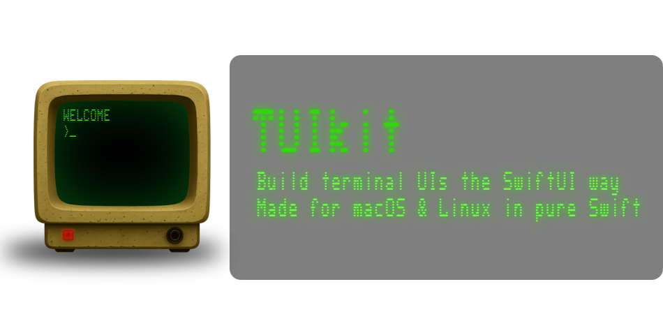

<p align="center">
    
    <a href="https://github.com/phranck/TUIkit/releases/latest"></a>
    
    
    
    <a href="https://github.com/phranck/TUIkit/actions/workflows/ci.yml"></a>
    
</p>



# TUIkit

> [!TIP]
> **☕ Support TUIkit Development**
>
> If you enjoy TUIkit and find it useful, consider supporting its development! Your donations help cover ongoing costs like hosting, tooling, and the countless cups of coffee that fuel late-night coding sessions. Every contribution, big or small, is greatly appreciated and keeps this project alive. Thank you! 💙
>
> [](https://paypal.me/LAYEREDwork)
> [](https://ko-fi.com/layeredwork)

> [!IMPORTANT]
> **This project is currently a WORK IN PROGRESS! I strongly advise against using it in a production environment because APIs are subject to change at any time.**

A SwiftUI-like framework for building Terminal User Interfaces in Swift: no ncurses, no C dependencies, just pure Swift.

## What is this?

TUIkit lets you build TUI apps using the same declarative syntax you already know from SwiftUI. Define your UI with `View`, compose views with `VStack`, `HStack`, and `ZStack`, style text with modifiers like `.bold()` and `.foregroundColor(.red)`, and run it all in your terminal.

```swift
import TUIkit

@main
struct MyApp: App {
    var body: some Scene {
        WindowGroup {
            ContentView()
        }
    }
}

struct ContentView: View {
    @State var count = 0
    
    var body: some View {
        VStack(spacing: 1) {
            Text("Hello, TUIkit!")
                .bold()
                .foregroundColor(.cyan)
            
            Text("Count: \(count)")
            
            Button("Increment") {
                count += 1
            }
        }
        .statusBarItems {
            StatusBarItem(shortcut: "q", label: "quit")
        }
    }
}
```

## Features

### Core

- **`View` protocol**: the core building block, mirroring SwiftUI's `View`
- **`@ViewBuilder`**: result builder for declarative view composition
- **`@State`**: reactive state management with automatic re-rendering
- **`@Environment`**: dependency injection for theme, focus manager, status bar
- **`App` protocol**: app lifecycle with signal handling and run loop

### Views & Components

- **Primitive views**: `Text`, `EmptyView`, `Spacer`, `Divider`, `Image` (ASCII art rendering, multiple color modes, async loading)
- **Layout containers**: `VStack`, `HStack`, `ZStack`, `LazyVStack`, `LazyHStack` with alignment and spacing
- **Interactive**: `Button`, `Toggle`, `Menu`, `TextField`, `SecureField`, `Slider`, `Stepper`, `RadioButtonGroup` with keyboard navigation
- **Data views**: `List`, `Table`, `Section`, `ForEach`, `NavigationSplitView`
- **Containers**: `Alert`, `Dialog`, `Panel`, `Box`, `Card`
- **Feedback**: `ProgressView` (5 bar styles), `Spinner` (animated)
- **`StatusBar`**: context-sensitive keyboard shortcuts

### Styling

- **Text styling**: bold, italic, underline, strikethrough, dim, blink, inverted
- **Full color support**: ANSI colors, 256-color palette, 24-bit RGB, hex values, HSL
- **Theming**: 6 predefined palettes (Green, Amber, Red, Violet, Blue, White)
- **Border styles**: rounded, line, double, thick, ASCII, and more
- **List styles**: `PlainListStyle`, `InsetGroupedListStyle` with alternating rows
- **Badges**: `.badge()` modifier for counts and labels on list rows

### Notifications

- **Toast-style notifications**: transient alerts via `.notificationHost()` modifier

### Internationalization (i18n)

- **5 languages built-in**: English, German, French, Italian, Spanish
- **Type-safe string constants**: Compile-time verified `LocalizationKey` enum
- **Persistent language selection**: Automatic storage with XDG paths
- **Fallback chain**: Current language → English → key itself
- **Thread-safe operations**: Safe language switching at runtime

### Advanced

- **Lifecycle modifiers**: `.onAppear()`, `.onDisappear()`, `.task()`
- **Key handling**: `.onKeyPress()` modifier for custom keyboard shortcuts
- **Storage**: `@AppStorage`, `@SceneStorage` with JSON backend
- **Preferences**: bottom-up data flow with `PreferenceKey`
- **Focus system**: Tab/Shift+Tab navigation, `.focusSection()` for grouped areas
- **Render caching**: `.equatable()` for subtree memoization

## Run the Example App

```bash
swift run TUIkitExample
```

Press `q` or `ESC` to exit.

## Installation

### Quick Start with CLI

Install the `tuikit` command and create a new project:

```bash
curl -fsSL https://raw.githubusercontent.com/phranck/TUIkit/main/project-template/install.sh | bash
tuikit init MyApp
cd MyApp && swift run
```

See [project-template/README.md](project-template/README.md) for more options (SQLite, Swift Testing).

### Manual Setup

Add TUIkit to your `Package.swift`:

```swift
dependencies: [
    .package(url: "https://github.com/phranck/TUIkit.git", branch: "main")
]
```

Then add it to your target:

```swift
.target(
    name: "YourApp",
    dependencies: ["TUIkit"]
)
```

> **Tip:** `import TUIkit` re-exports all sub-modules. For finer control you can import individual modules: `TUIkitCore`, `TUIkitStyling`, `TUIkitView`, or `TUIkitImage`.

## Theming

TUIkit includes predefined palettes inspired by classic terminals:

```swift
@main
struct MyApp: App {
    var body: some Scene {
        WindowGroup {
            ContentView()
        }
        .palette(SystemPalette(.green))  // Classic green terminal
    }
}
```

Available palettes (all via `SystemPalette`):
- `.green`: Classic P1 phosphor CRT (default)
- `.amber`: P3 phosphor monochrome
- `.red`: IBM 3279 plasma
- `.violet`: Retro sci-fi terminal
- `.blue`: VFD/LCD displays
- `.white`: DEC VT100/VT220 (P4 phosphor)

## Internationalization

TUIkit includes comprehensive i18n support with 5 languages and type-safe string constants:

```swift
import TUIkit

struct MyView: View {
    var body: some View {
        VStack {
            // Type-safe localized strings
            Text(localized: LocalizationKey.Button.ok)
            LocalizedString(LocalizationKey.Error.notFound)

            // Switch language at runtime
            Button("Deutsch") {
                AppState.shared.setLanguage(.german)
            }
        }
    }
}
```

**Supported languages**: English, Deutsch, Français, Italiano, Español

For complete documentation, see [Localization Guide](https://github.com/phranck/TUIkit/blob/main/Sources/TUIkit/TUIkit.docc/Articles/Localization.md) in the DocC documentation.

## Architecture

- **Modular package**: 5 Swift modules + 1 C target (see Project Structure below)
- **No singletons for state**: All state flows through the Environment system
- **Pure ANSI rendering**: No ncurses or other C dependencies
- **Linux compatible**: Works on macOS and Linux (XDG paths supported)
- **Value types**: Views are structs, just like SwiftUI

## Project Structure

```
Sources/
├── CSTBImage/            C bindings for stb_image (PNG/JPEG decoding)
├── TUIkitCore/           Primitives, key events, frame buffer, concurrency helpers
├── TUIkitStyling/        Color, theme palettes, border styles
├── TUIkitView/           View protocol, ViewBuilder, State, Environment, Renderable
├── TUIkitImage/          ASCII art converter, image loading (depends on CSTBImage)
├── TUIkit/               Main module: App, Views, Modifiers, Focus, StatusBar, Notification
│   ├── App/              App, Scene, WindowGroup
│   ├── Environment/      Environment keys, service configuration
│   ├── Focus/            Focus system and keyboard navigation
│   ├── Localization/     i18n service, type-safe keys, translation files (5 languages)
│   ├── Modifiers/        Border, Frame, Padding, Overlay, Lifecycle, KeyPress
│   ├── Notification/     Toast-style notification system
│   ├── Rendering/        Terminal, ANSIRenderer, ViewRenderer
│   ├── StatusBar/        Context-sensitive keyboard shortcuts
│   └── Views/            Text, Stacks, Button, TextField, Slider, List, Image, ...
└── TUIkitExample/        Example app (executable target)

Tests/
└── TUIkitTests/          1100+ tests across 150+ test suites (including i18n consistency & localization tests)
```

## Requirements

- Swift 6.0+
- macOS 14+ or Linux

## Developer Notes

- Tests use Swift Testing (`@Test`, `#expect`): run with `swift test`
- All 1172 tests run in parallel
- The `Terminal` class handles raw mode and cursor control via POSIX `termios`

## Contribution

## License

This repository has been published under the [MIT](https://mit-license.org) license.
